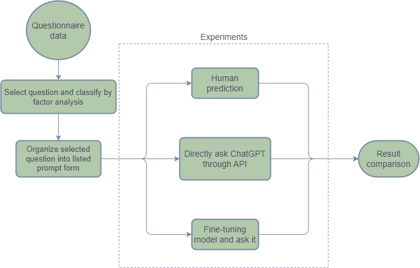

# Digital twins
Digital twins project done with NCCU Public Administration  
Special thanks to 蕭乃沂老師、郭毓倫學長 & 陳智彬學長  

# Motivation
在進行有效的問卷調查時，理想上需要受訪者能夠忠實反映自身立場，使填答內容不會過於偏激或失真。然而在實際操作中，除了需要蒐集大量樣本才能觀察出民意趨勢之外，這個過程也往往相當耗時耗力；同時，也常遇到部分受訪者的回答過於極端，導致該筆資料難以使用，進一步影響整體問卷品質。

基於上述問題，本研究希望初步探討是否能運用大型語言模型（LLM）來模擬真實的民意問卷填答行為。透過建立大量模擬樣本，在降低時間與人力成本的前提下，嘗試進行各類公共政策議題的初步民意調查，作為後續實際問卷設計與分析的參考。

# Dataset
由政大公行系提供的問卷資料，該問卷所要調查的問題為  
> **請問您支不支持核能發電?**

# Data Preprocessing
原始拿到的資料是純數據的資料，因此要將其根據相對應的codebook轉換成文字並將文字整理成問題和回應的成對選項，原始題目範例如下所示

| 題號| 問卷題目 | 問卷選項 |
|----------|----------|----------|
|Q1| 請問您支不支持核能發電？ | (01) 非常不支持 (02) 有點不支持 (03) 普通 (04) 有點支持 (05) 非常支持 (95) 拒答 (96) 很難說 (97) 無意見 (98) 不知道 |

# Method

# Experiment results

# Future work